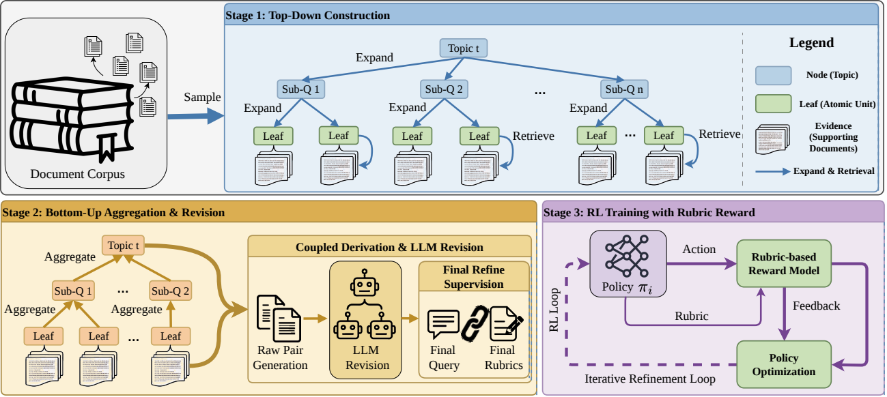

<div align="center">


# DeepRubric: Evidence-Tree Rubric Supervision for Efficient Reinforcement Learning of Deep Research Agents

[**Project Page**](https://zminghang.github.io/DeepRubric-Code/) • [**Data Guide**](docs/DATA.md) • [**Retriever Setup**](retrievers/) • [**Data Construction**](data_construction/) • [**Data Conversion**](data_conversion/) • [**Training Code**](training/verl-tool/)
</div>

DeepRubric is an evidence-first data construction and reinforcement-learning pipeline for deep research agents. It builds grounded query-rubric supervision from local retrieval corpora, filters or revises the generated samples, converts them into verl-tool training data, and then trains a tool-using agent with the same retriever endpoints.

This repository contains the code, scripts, and command templates needed to reproduce the pipeline. It does not include large corpora, FAISS indexes, generated datasets, model checkpoints, logs, or private service configs.

<div align="center">

</div>

## Overview

This repository contains four main components:

- **[`retrievers/`](retrievers/)**: Launch wrappers for the local Wikipedia and OpenScholar retrievers used by both data construction and training.
- **[`data_construction/`](data_construction/)**: Evidence-tree expansion, query/rubric synthesis, and LLM-based KEEP/REVISE/DROP verification.
- **[`data_conversion/`](data_conversion/)**: Converters from verified evidence-tree records to verl-tool JSONL and parquet datasets.
- **[`training/verl-tool/`](training/verl-tool/)**: Sanitized verl-tool training code and DeepRubric GRPO entrypoints.

For detailed setup and usage notes, see the README files in each subdirectory.

## External Requirements

Prepare these external resources before running the full pipeline:

- A Python environment for data construction and `training/verl-tool`.
- A local Wikipedia retriever built from ASearcher assets.
- A local OpenScholar retriever/datastore.
- An OpenAI-compatible LLM endpoint for query/rubric synthesis and verification.
- A model checkpoint and GPUs for GRPO training.

## Reproduction Workflow

The reproduction path is a single closed loop:

```text
download retriever assets
  -> deploy local retrievers
  -> construct evidence trees
  -> verify KEEP/REVISE/DROP samples
  -> convert verified samples to parquet
  -> launch verl-tool GRPO training
```

Each stage has a concrete input and output:

| Stage | Main code | Input | Output |
| --- | --- | --- | --- |
| Deploy retrievers | `scripts/start_retrievers.sh`, `retrievers/` | Downloaded Wikipedia and OpenScholar assets | Local HTTP retriever endpoints |
| Construct evidence trees | `data_construction/recursive_qa_agent_v4.py`, `data_construction/recursive_qa_agent_v44.py` | Retriever endpoints, corpus pages, LLM endpoint | `outputs/*_evidence_trees/` |
| Verify samples | `data_construction/recursive_qa_quality_filter.py` | Evidence-tree records | `outputs/verified_trees/*.jsonl` |
| Convert training data | `data_conversion/` | Verified tree JSONL | `data/query_1001.jsonl`, `train.parquet`, `test.parquet` |
| Train agent | `training/verl-tool/` | Parquet data, model checkpoint, retrievers | GRPO checkpoints and logs |

The same retriever services are intentionally reused during data construction and RL training:

| Use | Environment variable | Default endpoint |
| --- | --- | --- |
| Wikipedia retrieval for tree construction | `WIKI_RETRIEVER_URL` | `http://localhost:8888/retrieve` |
| Wikipedia retrieval for training `search` tool | `SEARCH_URL` | `http://localhost:8888/retrieve` |
| Wikipedia page lookup for training `browse` tool | `BROWSE_URL` | `http://localhost:8888/access` |
| OpenScholar retrieval for tree construction | `OPENSCHOLAR_RETRIEVER_URL` | `http://localhost:8000/search` |
| OpenScholar retrieval for training `scholar` tool | `SCHOLAR_URL` | `http://localhost:8000/search` |

## Quick Start

Clone the repository and install the training stack in your preferred Python or conda environment:

```bash
git clone https://github.com/ZMingHang/DeepRubric-Code.git
cd DeepRubric-Code

cd training/verl-tool
pip install -r requirements.txt
pip install -e ./verl
pip install -e .
cd ../..
```

Install data-construction dependencies in the same environment or a separate one:

```bash
pip install openai aiohttp requests numpy pandas tqdm transformers datasets fastapi uvicorn
```

The retriever servers additionally require their own dependencies, including FAISS, PyTorch, and the dependencies from the ASearcher and OpenScholar retrieval codebases.

Configure an OpenAI-compatible endpoint for evidence-tree construction and quality verification:

```bash
export OPENAI_BASE_URL=http://localhost:8008/v1
export OPENAI_API_KEY=EMPTY
```

Do not bind this LLM service to port `8000` if you use the default OpenScholar retriever, because OpenScholar serves `http://localhost:8000/search`.

Model names can be overridden with:

```bash
export QA_MODEL=deepseek/deepseek-chat
export EXTRACT_MODEL=Qwen/Qwen3.5-35B-A3B-Instruct
export JUDGE_MODEL=gpt-5.1
```

After setting the asset paths and endpoint URLs below, the full command template is:

```bash
START_RETRIEVERS=1 bash scripts/run_pipeline.sh
```

If the retrievers are already running in another terminal, use:

```bash
bash scripts/run_pipeline.sh
```

`scripts/run_pipeline.sh` is a reproduction template. Check local paths, model names, retriever ports, and GPU settings before using it for a full run.

## External Assets

Download the external retriever assets and code:

- ASearcher code for the local Wikipedia retriever: <https://github.com/inclusionAI/ASearcher>
- Wikipedia retriever assets: <https://huggingface.co/datasets/inclusionAI/ASearcher-Local-Knowledge>
- OpenScholar datastore: <https://huggingface.co/datasets/OpenSciLM/OpenScholar-DataStore-V3>

Set paths to your local copies. The defaults in the scripts are virtual placeholders and must be replaced for a real run:

```bash
export WIKI_CODE_ROOT=/path/to/ASearcher-main
export WIKI_RETRIEVER_ROOT=/path/to/ASearcher-Local-Knowledge
export OPENSCHOLAR_DATA_ROOT=/path/to/OpenScholar-DataStore-V3
export OPENSCHOLAR_API_ROOT=/path/to/OpenScholar-main/retriever2/retrieval-scaling-main
```

Expected Wikipedia layout:

```text
$WIKI_RETRIEVER_ROOT/
  e5.index/e5_Flat.index
  wiki_corpus.jsonl
  wiki_webpages.jsonl
  wikilinks.json
  e5-base-v2/
```

For OpenScholar, configure the retrieval-scaling Hydra config under `OPENSCHOLAR_API_ROOT` so it points to your local datastore and index files.

Set the default endpoints used by both data construction and training:

```bash
export WIKI_RETRIEVER_URL=http://localhost:8888/retrieve
export WIKI_BROWSE_URL=http://localhost:8888/access
export OPENSCHOLAR_RETRIEVER_URL=http://localhost:8000/search
export SEARCH_URL="$WIKI_RETRIEVER_URL"
export BROWSE_URL="$WIKI_BROWSE_URL"
export SCHOLAR_URL="$OPENSCHOLAR_RETRIEVER_URL"
```

## 1. Deploy Retrievers

Start both retrievers and keep the process running:

```bash
bash scripts/start_retrievers.sh
```

This writes logs to:

```text
outputs/retriever_logs/wiki.log
outputs/retriever_logs/openscholar.log
```

You can also start them separately:

```bash
bash retrievers/wiki/launch_local_server.sh
bash retrievers/openscholar/start_single_node.sh
```

The training scripts expect the same endpoints through `SEARCH_URL`, `BROWSE_URL`, and `SCHOLAR_URL`. Override them only if you changed the retriever ports.

## 2. Construct Evidence Trees

Generate Wikipedia evidence trees:

```bash
python data_construction/recursive_qa_agent_v4.py \
  --pages "$WIKI_RETRIEVER_ROOT/wiki_webpages.jsonl" \
  --links "$WIKI_RETRIEVER_ROOT/wikilinks.json" \
  --save outputs/wiki_evidence_trees \
  --retriever-url "$WIKI_RETRIEVER_URL" \
  --qa-model "$QA_MODEL" \
  --extract-model "$EXTRACT_MODEL" \
  --n 1000
```

Generate OpenScholar evidence trees:

```bash
python data_construction/recursive_qa_agent_v44.py \
  --pages "$OPENSCHOLAR_DATA_ROOT/passages/raw_passages-0-of-16.jsonl" \
  --save outputs/openscholar_evidence_trees \
  --retriever-url "$OPENSCHOLAR_RETRIEVER_URL" \
  --qa-model "$QA_MODEL" \
  --extract-model "$EXTRACT_MODEL" \
  --n 1000
```

Outputs:

```text
outputs/wiki_evidence_trees/
outputs/openscholar_evidence_trees/
```

## 3. Verify and Export Samples

Run the verifier and export retained or revised records:

```bash
mkdir -p outputs/verified_trees

python data_construction/recursive_qa_quality_filter.py \
  --input outputs/wiki_evidence_trees \
  --output-dir outputs/wiki_audited \
  --revised-output outputs/verified_trees/wiki_verified.jsonl \
  --include-keep-in-revised \
  --judge-model "$JUDGE_MODEL"

python data_construction/recursive_qa_quality_filter.py \
  --input outputs/openscholar_evidence_trees \
  --output-dir outputs/openscholar_audited \
  --revised-output outputs/verified_trees/openscholar_verified.jsonl \
  --include-keep-in-revised \
  --judge-model "$JUDGE_MODEL"
```

The verifier checks query-rubric alignment, evidence support, merge faithfulness, rubric atomicity, redundancy, and scoring validity.

## 4. Convert to Training Data

Convert verified tree records to query-rubric JSONL:

```bash
python data_conversion/read_form_tree_revise.py \
  --input-dir outputs/verified_trees \
  --output-dir data \
  --output-file query_1001.jsonl
```

Convert JSONL to verl-tool parquet:

```bash
python data_conversion/preprocess_search_r1_dataset_tool.py \
  --input_file data/query_1001.jsonl \
  --local_dir training/verl-tool/data/deeprubric \
  --test_size 10
```

Outputs:

```text
data/query_1001.jsonl
training/verl-tool/data/deeprubric/train.parquet
training/verl-tool/data/deeprubric/test.parquet
```

## 5. Start GRPO Training

Keep the retrievers running, then launch training:

```bash
cd training/verl-tool

export MODEL_PATH=Qwen/Qwen3-8B
export DATASET_NAME=deeprubric
export N_GPUS_PER_NODE=8
export TRAIN_BATCH_SIZE=64
export TRAINER_LOGGER="['console']"

export SEARCH_URL=http://localhost:8888/retrieve
export BROWSE_URL=http://localhost:8888/access
export SCHOLAR_URL=http://localhost:8000/search

bash examples/train/deepsearch/train_4b_tool.sh
```

Useful overrides:

```bash
export TRAIN_DATA=/path/to/train.parquet
export VAL_DATA=/path/to/test.parquet
export CHECKPOINT_DIR=/path/to/checkpoints
export LOG_DIR=/path/to/logs
export TOOL_SERVER_HOST=0.0.0.0
export TOOL_SERVER_PORT=30500
export WORKERS_PER_TOOL=16
```

The training script starts the internal verl-tool server with:

```text
tool_search_multi,tool_browse,tool_scholar_multi
```

Those tools call the external retriever endpoints above during rollout.

## Full Pipeline Script

The Quick Start command is a wrapper around the step-by-step workflow above. It runs:

```text
retriever startup, if START_RETRIEVERS=1
  -> Wikipedia tree construction
  -> OpenScholar tree construction
  -> quality verification
  -> JSONL conversion
  -> parquet conversion
  -> GRPO training startup
```

## Notes

- The paper uses Wikipedia and OpenScholar as source corpora and retains roughly 9K verified query-rubric pairs.
- The released scripts use placeholder paths such as `/path/to/...`; replace them with your local data locations.
- No generated training data, model checkpoints, logs, private IPs, or API keys are included.
- Evaluation can swap the local training tools for live search APIs if they implement the same tool interface.

## Citation

```bibtex
@misc{deeprubric,
  title = {DeepRubric: Evidence-Tree Rubric Supervision for Efficient Reinforcement Learning of Deep Research Agents},
  author = {Anonymous},
  year = {2026}
}
```
